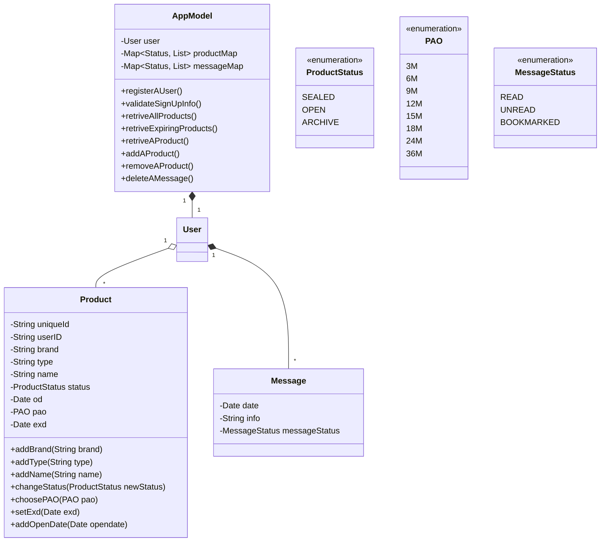

# Final Project - BeautyHabit Tracker

## Software Requirements Specification

### 1. Purpose
This document aims to build a mobile application to help consumers manage their beauty habits and encourage them to buy environmentally friendly refillable beauty products.

#### 1.1 Definitions
|   **Terms**  | Definition                                                                                                                                                                                                                                                                                                                                                                                    |
|:------------:|-----------------------------------------------------------------------------------------------------------------------------------------------------------------------------------------------------------------------------------------------------------------------------------------------------------------------------------------------------------------------------------------------|
| **Consumer** | People who purchase cosmetics and skin care products                                                                                                                                                                                                                                                                                                                                          |
| **User**     | User of the mobile application                                                                                                                                                                                                                                                                                                                                                                |
| **RBP**      | Refillable beauty product: includes refillable cosmetics and refillable skincare products. After purchasing the initial vessel and finishing the formula within, one can simply purchase a refill for a product — often in the form of a less-packaging-intensive pod, pouch, or cartridge — instead of another full-size jar, bottle, or tube.                                               |
| **PD**       | Purchase date: the date that the consumer purchases the product (includes the order date of an online purchase.)                                                                                                                                                                                                                                                                              |
| **OD**       | Open date: the date that the consumer unsealed the product.                                                                                                                                                                                                                                                                                                                                   |
| **EXD**      | Expiration date: the date that the product will expire and should not be used anymore. Usually, this date must be specified only for products whose shelf life period is 30 months or less. If this date is present, it should be printed directly on the product package; for example, Exp. 09/25/2025 means that makeup can be used only before 25 September 2025.                          |
| **PAO**      | Period after opening: usually, on the beauty product package, there is an “open jar” sign with a number followed by the letter M, where the number indicates how many months the product can be safely used after opening. For example,  6M means that the product can be used for six months after opening; 12M means that the product can be used for twelve months after you open it, etc. |
| **TTF**      | Time to finish using up one product: the period between the open date and the finish date.
| **Beauty Habit**      | It refers to the habit of using beauty products, including the frequency of use, the number/cycle of repeated purchases, whether it can be used before the expiration date,etc.                                                              

#### 1.2 Background
The cosmetics and skincare product market expansion is accompanied by lousy consumption habits and unnecessary environmental pollution.
On the one hand, it's hard for consumers to **remember all products they have** at home and **the EXD of each product**. When a consumer buys too many products, it’s easy for him/her to forget what they are and don't use them until EXD. Many consumers are not even aware of the harm caused by expired products. Occasionally, they use those expired products, getting adverse effects on their skin. 
 
On the other hand, to ease the environmental pollution caused by product containers, as a trend, many beauty companies are now promoting RBP. However, many consumers don't buy it. Not only because they don't know about the benefits of RBP but also because they often cannot estimate the usage time since they don't have clear product usage habits.
 
Therfore, a durable, convenient way to manage beauty habits is in great need.
                                                                

### 2. Overall Description
#### 2.1 User Characteristics
Most of them are cosmetics and skincare lovers.

Environment:  IOS & Android

#### 2.2 User Stories

As a consumer who has a routine for burying and using beauty products, I want the app to log the PD and OD of my products and automatically set a reminder that I need to throw them away based on the EXD and PAO.

As a beauty product/make-up guru, I want to scan all my beauty products into the app so that the app can help me track the EXD of the products.

As a beauty product/make-up guru, I want the app to remind me of which products are about to expire so that I can prioritize using them.

#### 2.3 App Workflow (flowchart)

### 3. Requirement
#### 3.1 Functional
- Log in products and their expiration dates
  - The system shall store a variety of beauty products and allow users to choose the product they own (for now)
  - The system shall let the user log in the OD.

- Reminder to use products that were bought and need to be used.

  - The system shall handle use cases where the user has unused new products which need to be used before their EXD.

- Have a User Profile 

  - The user profile shall display all the products logged and tracked by the user.

  - The profile shall also have a list of favorites/frequently bought items that are refilled in a specific timeframe (monthly/every 6 months)

- Send notifications of expiring products

  - The system shall track the EXD or PAO of the product and the current date, and send users reminders when the product is about to expire

#### 3.2 Non-functional
- The system shall be designed to have regular push notifications pertaining to skincare/make up for the User’s skin type.

- The system shall be implemented to integrate API from TikTok to recommend products from the users’ favorite skincare/makeup influencers.

- The system shall be able to offer discounts on product subscriptions.

#### UML diagram

#### Gantt Chart

#### Traceability Matrix

